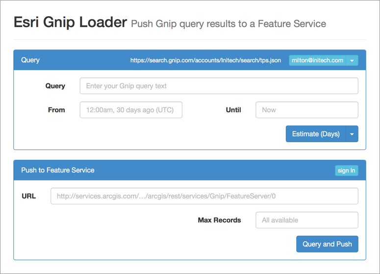
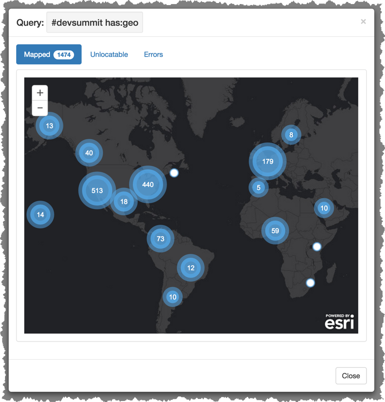

#esri-gnip-loader
A tool to query Gnip and store the results in an ArcGIS Feature Service. Go [here](https://esri-gnip.herokuapp.com) for a live demo.

##Features
* HTML5 Application
    * Simple UI to connect to and query Gnip
    * Estimate a Gnip query before running it
    * Single-click query and upload
    * Single-click create target ArcGIS Online Feature Service
    * OAuth authentication with ArcGIS Online
* Node.js REST service
    * Query & Push from Gnip to a Feature Service with a single call
    * Filtering of Gnip results by availability of geolocation info
    * Intelligent optimization of Gnip query usage
    * Create new Gnip Feature Service with a single call
* Easily deployable to Heroku

## Requirements

* [Node.js](http://nodejs.org)
* A [Gnip](http://gnip.com) account
* An ArcGIS Online account ([Developer](https://developers.arcgis.com/en/sign-up/) or [Organizational](http://www.arcgis.com/features/))

The ArcGIS Online account is optional, but recommended. If you do not have an ArcGIS Online account, you must have the URL to a suitable public feature service with editing enabled (see [this page](https://github.com/esri/esri-gnip#creating-a-target-feature-service) for more details).

## Installation
* Install node
* Clone or download this repo

## Starting the service
At the terminal, from the repo's folder, execute:

        $ node app

Open up a web browser at [http://localhost:1337](http://localhost:1337)

**Note:** For full functionality, create and configure an ArcGIS Online Application [as discussed below](#configuring-oauth-and-arcgis-online), and start the app with the new Application's `Client ID`:

        $ CLIENT_ID='<Your App's Client ID>' node app

## Using the app
The web application walks you through:

* Connecting to Gnip
* Fine-tuning a Gnip query
* Executing the query
* Storing the results in a Feature Service for use in maps or spatial analysis

### 1. Enter Gnip account details
When you first open the HTML5 application, it will walk you through providing Gnip credentials and details. You'll need your *Account ID* and Search API *Stream Name* (see [below](#gnip-account-and-stream-name)) for more details). This is important: **If you don't have a Gnip account, you can't get any further**. 

The app remembers the `Username`, `Account` and `Stream` so you won't need to enter them repeatedly. In `development` mode, the password will also be stored (see [below](#development-mode-vs-production-mode)).

When not in `development` mode, if you have already entered your Gnip account info, you will instead only be prompted for the password.

Once you've provided your Gnip account details and credentials, you'll see the full app:

Let's walk through it.

### 2. Estimate a Gnip Query
In the first panel, the "Query" panel, you specify a Gnip query, optionally including start and end dates. This is used for both Estimates and full Queries. It's good to run Estimates first because the costs to run queries with large result sets can quickly add up!

Below we're going to ask for all tweets mentioning "esri" in the last 30 days (the default Gnip date range).

Gnip returns estimated counts broken down into "buckets" of Minutes, Hours or (as in this case) Days. See [this note](#gnip-default-date-ranges) if you're confused by why there are 31 buckets returned for 30 days of tweets.

**Refining with "has:geo"**

For pushing data into a Feature Service, you'll only want to ask for data that has a geolocation. The esri-gnip-loader will filter non-geolocated tweets from any results, but you can minimize the tweets (and so the cost) of making your Gnip request by including `has:geo` somewhere in your query string.

In this case, it reduces the tweets to be retrieved from 14,701 to 378! Without `has:geo` Gnip would have charged us for 14,323 tweets we couldn't have mapped.

### 3. Run the query & push to a Feature Service
Once you've estimated your query and you're happy with the number of tweets you'll get back, you can push the tweets to a Feature Service.

If you have a [suitable feature service](https://github.com/esri/esri-gnip#creating-a-target-feature-service) already available, you can push your tweets directly to it, but it is recommended you create a new one using the tools in the "Push to Feature Service" panel.

**OAuth and ArcGIS Online**

Before the esri-gnip-loader can create a new feature service, you must authorize it using your ArcGIS Online account. Click "sign in" to see the OAuth authentication popup.

**Creating a target Feature Service**

Once authenticated, your ArcGIS Online username will be displayed, and you will see an option to create a new feature service to receive the Gnip records. The "New Feature Service" text field automatically checks whether the name you entered is available as a service or not, as you'll see in a moment.

Enter a name and click "Create". If the name is crossed out and the "Create" button is disabled, this is because that name is already in use by your developer account or organization.

A new feature service will be created, and its URL automatically added to the "URL" field.

Notice that the Create option is now disabled, because the text in the "New Feature Service" field is now taken by the newly created service.

**Run the query and add records to the Feature Service**

Now press "Query and Push". Gnip records (tweets) will be retrieved and pushed to the ArcGIS Feature Service. This can take a little time depending on the number of tweets being returned, and you will given progress updates during the process.

When complete, you'll see a map of all tweets which could be geolocated:

There are also tabs on the results panel to examine any records that could not be geolocated or that caused an error when pushed to the Feature Service. If you are including `has:geo` in your Gnip query, you should not see anything listed in either tab.

And that's all there is to it. Enjoy! The URL to your feature service can be added to maps, apps, and more, and provides full REST access to the geo-enabled tweet records.

**Note:** The Gnip query-and-push runs on the server. However, you should not press refresh. If you do, you will not be able to get status updates and follow the query-and-push operation's progress. An [enhancement](#enhancements) is planned to address this.

## Configuring OAuth and ArcGIS Online
To create new target feature services, or write to private feature services to which you have publishing rights, you will need to configure esri-gnip-loader for ArcGIS Online OAuth. First you must create an ArcGIS Online Application [here](https://developers.arcgis.com/en/applications/). You will need to get the new app's Client ID and set its Redirect URIs appropriately

#### Client ID
The Client ID is found in the OAuth Credentials section of your new application's settings:

esri-gnip-loader will read the `CLIENT_ID` environment variable to determine how to identify itself to ArcGIS Online when performing OAuth authentication. You can either define a global environment variable on your system with something like the following (which you may prefer to add to your `.profile` or equivalent):

     $ export CLIENT_ID='<Client ID from ArcGIS Online>'
     
before running esri-gnip-loader with:
     
     $ node app

or run esri-gnip-loader with an environment variable override:

     $ CLIENT_ID='<Client ID from ArcGIS Online>' node app

#### Redirect URIs
For OAuth to return authentication approval to esri-gnip-loader, the OAuth popup needs to know where to send this info. This is configured in the `Redirect URIs` section of the ArcGIS Online Application settings:

`http://localhost:1337` is necessary to run the app locally in node.

**Note:** ArcGIS OAuth then knows to look for `http://localhost:1337/oauth-callback.html`. This file is included in this repo. No additional configuration is necessary.

## Deploying to Heroku
The esri-gnip-loader can be deployed directly to Heroku as-is. However, to make use of OAuth for authenticating against ArcGIS Online, you will need to provide an ArcGIS Application's Client ID and configure its Redirect URIs (see above).

See [here](https://devcenter.heroku.com/articles/getting-started-with-nodejs#introduction) for instructions on deploying a node app to Heroku, but in short, here's what you need to cover:

1. Create a new Heroku App with 1 Dyno (see [below](#only-use-1-dyno-on-heroku)).
2. Create a Git Remote in your local copy of this repo, pointing at your Heroku App's git URL.
3. Create an ArcGIS Online Application (see [above](#configuring-oauth-and-arcgis-online)).
4. Configure the `CLIENT_ID` environment variable for your Heroku App.

5. Configure the ArcGIS Online Application's Redirect URIs to include the Heroku URL. Note the `https` which is enforced when the `NODE_ENV` is `production`:

6. Git Push the repo to the heroku remote.

## Additional Notes
### Gnip Account and Stream Name
If you're unsure about the Account ID and Stream Name, log in to [the Gnip Console](https://console.gnip.com/) and click on the **Twitter Search API** section to be shown what your Search API URL is. For example, if your Search API URL is:

        https://search.gnip.com/accounts/Initech/search/tps.json

then your these are your settings:

* Account: `Initech`
* Stream: `tps`

### Gnip Estimate "Buckets"
Gnip returns count estimates in buckets of minutes, hours, or days. The application allows you to choose, but at present no use is made of the bucket counts.

### Gnip default date ranges
If you don't specify a start date, Gnip will go back to the start of the day 30 days ago. That is, Gnip will go back 30 x 24 hours, and use the *start* of that day. This means that when getting an estimate with a bucket-size of `Days`, you will almost certainly see 31 and not 30 buckets. This is expected behavior.

### Development mode vs Production mode
By default esri-gnip-loader runs in `development` mode (except on Heroku, where the default is `production`). Override this by setting the `NODE_ENV` environment variable. No other values are recognized by the app.

In `development` mode (default on localhost):

* Logs of responses to REST requests are written to `test/temp-data`.
* The current Gnip password is stored in a cookie on the browser.
* A banner is displayed at the top-left of the page that reads `[Development Mode]`.

In `production` mode (default on Heroku):

* Logs are **not** kept of responses to REST requests.
* The current Gnip password is **not** stored in a cookie in the browser. **Note:** If you previously ran in `development` mode, any existing cookies storing the password will remain.
* When opening or refreshing the app, the user will be prompted to re-enter their Gnip password.
* Other application settings (Gnip username, account, stream, query parameters, ArcGIS Feature Service details, etc.) will still be stored in a browser cookie.
* HTTPS redirect. Visiting the app with `http://` will result in an immediate redirect to `https://`. Ensure that your server is correctly configured for this (Heroku by default is correctly configured).

#### Hint
While `development` and `production` are the only recognized values, you can trigger a third behavior by providing a value that is neither `development` nor `production` (e.g. `staging`, `arglebargle` or `foofaraw` etc.). This will behave as follows:

* No password stored
* No HTTPS redirect
* No Logs of REST responses written to file system
* No "Development Mode" banner displayed

### Security and cookies
In `development` mode only, the Gnip password is stored in a browser cookie (see above).

### Only use 1 Dyno on Heroku
Providing feedback while records are queried and pushed relies on maintaining and accessing state on the server. State is stored in in-memory session state. Using more than 1 Dyno could mean that session state cannot be retrieved for a given progress-update request, which would cause an error in the HTML App. Note, the query-and-push would eventually complete and succeed, but it will not be possible to get feedback on its progress.

## Enhancements
The following enhancements are planned:

* Make use of bucket sizes to graph estimate results.
* Persist result reports in the browser.
* Handle a browser refresh more gracefully while a query-and-push is happening.
* Handle sessions in a multi-worker environment, such as Heroku with more than 1 Dyno (see [above](#only-use-1-dyno-on-heroku)).

## Resources

This project is not ashamed to make use of (and would likely not exist without) some awesome 3rd party components/packages. OK, so the first two spun out from this project, but they're still pretty cool.

* [gnip-reader](https://github.com/esri/gnip-reader)
* [esri-gnip](https://github.com/esri/esri-gnip)
* [bootstrap-map-js](https://github.com/Esri/bootstrap-map-js)
* [lodash](https://lodash.com)
* [Moment.js](http://momentjs.com)
* [spin.js](http://fgnass.github.io/spin.js/)
* [datetimepicker](http://xdsoft.net/jqplugins/datetimepicker/)
* [placeholder](https://github.com/mathiasbynens/jquery-placeholder)
* [SweetAlert](http://tristanedwards.me/sweetalert)
* [Q](https://github.com/kriskowal/q)
* [Request](https://github.com/mikeal/request)
* [Async.js](https://github.com/caolan/async)
* [node-uuid](https://github.com/broofa/node-uuid)
* [conflate](https://github.com/kommander/conflate.js)
* [express-js](http://expressjs.com)
    * [express-session](https://github.com/expressjs/session)
    * [response-time](https://github.com/expressjs/response-time)
    * [body-parser](https://github.com/expressjs/body-parser)
    

## Issues

Find a bug or want to request a new feature?  Please let us know by submitting an Issue.

## Contributing

Anyone and everyone is welcome to contribute. 

## Licensing
Copyright 2014 Esri

Licensed under the Apache License, Version 2.0 (the "License");
you may not use this file except in compliance with the License.
You may obtain a copy of the License at

   http://www.apache.org/licenses/LICENSE-2.0

Unless required by applicable law or agreed to in writing, software
distributed under the License is distributed on an "AS IS" BASIS,
WITHOUT WARRANTIES OR CONDITIONS OF ANY KIND, either express or implied.
See the License for the specific language governing permissions and
limitations under the License.

A copy of the license is available in the repository's [license.txt](license.txt) file.

